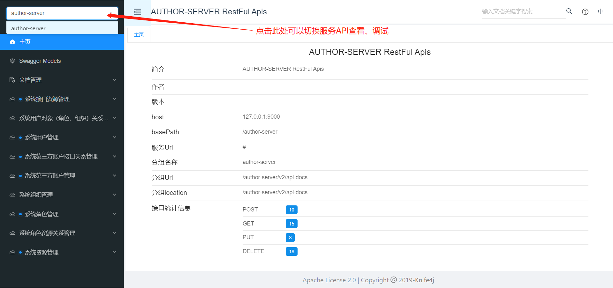

## 微服务网关
 功能：
 - Swagger API增强管理

   网关启动后，会自动代理Nacos注册中心所有服务的RestFul Api文档信息，可以访问`http://ip:port/doc.html`进行查看、调试

   

 - 统一鉴权、会话管理

   网管会在所有请求进来对其进行路由转发之前，对这个请求进行鉴权，如果某个接口不需要Token鉴权那么可以通过以下配置进行配置，多个地址用`，`号隔开

   ```properties
   # 鉴权忽略请求
   system.request.ignore-token.urls=/author-server/smUser/authorSmUser,/author-server/authorSmAccount
   ```

   网关对接口权限的控制主要依赖于：

   ```xml
   <!-- 服务接口控制 -->
   <dependency>
       <groupId>org.feasy.cloud</groupId>
       <artifactId>server-permission-apis-spring-boot-starter</artifactId>
   </dependency>
   ```

   对于特定用户或具有特定权限才能访问的接口可以通过`@VerifyPermission(name="接口名称",keys={"权限标识1","权限标识2"})`注解来控制

   项目启动及运行过程中会监听Nacos服务注册列表，如果有新服务注册或下线，网关会自动更新该服务的接口、权限信息。

 - 路由转发，限流，服务熔断

 - 负载均衡访问路由